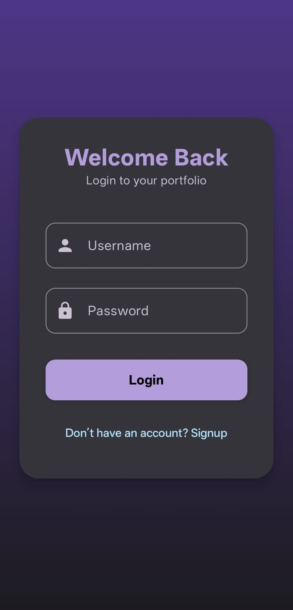
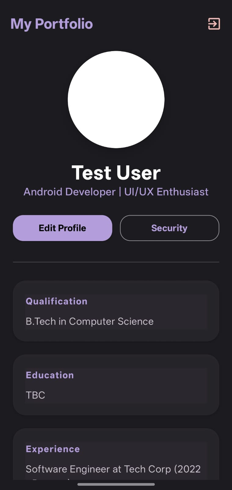
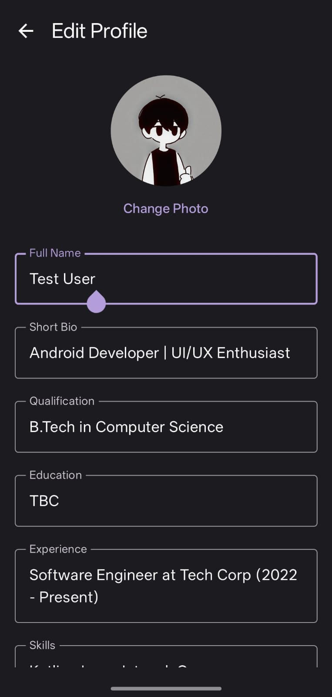

# 📱 Personal Portfolio Android App

A sleek, modern, and persistent Personal Portfolio application built with **Jetpack Compose** and **Material 3**. This app allows users to showcase their professional identity, manage their profile details, and maintain a secure personal space.

---

## ✨ Features

### 🔐 Authentication System (MVVM)
- **Login & Signup**: Secure entry point with validation logic using the **MVVM architecture**.
- **Change Password**: Dedicated security screen to update user credentials.
- **Logout Confirmation**: Safety dialog to prevent accidental logouts with proper state reset.
- **Toast Notifications**: Real-time feedback for all user actions (success, failure, logout).

### 🏠 Dynamic Portfolio (Home)
- **Professional Display**: Showcases Name, Bio, Education, Experience, and Skills in a clean, card-based layout.
- **Profile Photo**: Displays a custom user-uploaded image with a modern elevated design.
- **Responsive Design**: Optimized for all screen sizes using `LazyColumn` and adaptive layouts.

### ✏️ Profile Management
- **Live Editing**: Real-time updates to all portfolio fields.
- **Image Picker**: Integration with the device gallery to upload and update profile photos.
- **Data Persistence**: All text and image data are saved permanently to the device storage.

### 🎨 Design & UI
- **Pastel Purple Theme**: A custom-crafted aesthetic using a soft pastel palette.
- **Material 3**: Utilizing the latest Android design components (Cards, TopAppBars, Surfaces).
- **Smooth Navigation**: Custom state-based navigation for a seamless user experience.

---

## 🛠️ Tech Stack

- **Language**: Kotlin
- **UI Framework**: Jetpack Compose
- **Architecture**: MVVM (Model-View-ViewModel)
- **Design System**: Material Design 3 (M3)
- **Image Loading**: Coil (kt)
- **Persistence**: SharedPreferences & Internal File Storage

---

## 💾 Data Persistence Workflow

The app ensures your data is never lost, even after a device restart:
- **Text Fields**: Stored in `SharedPreferences` as key-value pairs.
- **Profile Image**: When an image is selected from the gallery, the app creates a **permanent copy** inside its private internal storage. This ensures the image remains available even if the original gallery photo is moved or deleted.

---

## 🚀 How to Run

1. **Clone the project** into Android Studio.
2. **Sync Gradle** to download dependencies (including Coil and Lifecycle components).
3. **Run the app** on an emulator or physical device.
4. **Test Credentials**:
   - **Username**: `admin`
   - **Password**: `password`
   - *(Or create your own account via the Signup page)*

---

## 📸 Screenshots

| Login Screen | Home Portfolio | Edit Profile |
| :---: | :---: | :---: |
|  |  |  |

---

## 📝 TODO Checklist (Status)

- [x] Login & Signup UI
- [x] MVVM Architecture Implementation
- [x] Navigation Logic & Logout Fix
- [x] Portfolio Home Display
- [x] Edit Profile Functionality
- [x] Image Upload Integration
- [x] Local Data Persistence (Text + Images)
- [x] Custom Pastel Theme
- [x] Toast Notifications
- [ ] Backend/Cloud Database Integration (Next Step)

---

## 🤝 Contributing

Contributions, issues, and feature requests are welcome! Feel free to check the [todo.md](todo.md) for upcoming tasks.

---

⭐ **If you like this project, give it a star!**
